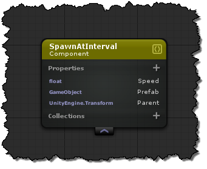
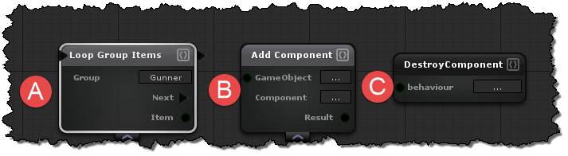

# Components (The "C" in ECS)
Components allow you to organize data into separate pieces.  In uFrame Components can be added directly to a gameObject directly in the Unity Editor.  In ECS components are structures for storing variables or properties that are needed to perform a behaviour or multiple behaviours.


## Scripting
#### Related Actions

##### A - Loop Group Items
Loops through all components, or group items for the selected "Group".

##### B - Add Component
Adds the selected "Component" to a gameobject

##### C - Destroy Component
Destroys  the selected "Component"

#### Related Events
- [On Component Created](../Handlers/ComponentCreated.md)
- [On Component Destroyed](../Handlers/ComponentDestroyed.md)
- [On Property Changed](../Handlers/PropertyChanged.md)

# API Documentation
## Properties
Properties are generated as both regular properties, and observables. So in code you can easily subscribe to any property as follows.

```cs
healthComponent.ValueObservable
  .Subscribe(value=>Debug.Log(value + " is the new health value!"))
  .DisposeWith(healthComponent); // Should always be disposed when the component disposes
```

#### Example Generated Component

```cs
[uFrame.Attributes.uFrameIdentifier("59383a7f-bf19-427f-b637-02e21c0957a0")]
public partial class Health : uFrame.ECS.EcsComponent {

     private Subject<Int32> _ValueObservable;

     [UnityEngine.SerializeField()]
     private Int32 _Value;

     public int ComponentID {
         get {
             return 6;
         }
     }

     public IObservable<Int32> ValueObservable {
         get {
             if (_ValueObservable == null) {
                 _ValueObservable = new Subject<Int32>();
             }
             return _ValueObservable;
         }
     }

     public Int32 Value {
         get {
             return _Value;
         }
         set {
             _Value = value;
             if (_ValueObservable != null) {
                 _ValueObservable.OnNext(value);
             }
         }
     }
}
```

## F.A.Q
Can I used a component as a event handler group?
Yes!
Can I use regular instantiate and destroy methods?
Yes! All Ecs Components you add to your gameobjects will automatically register themselves when loaded, and when destroyed using UnityEngine.Object.Destroy || UnityEngine.Object.Instantiate.
