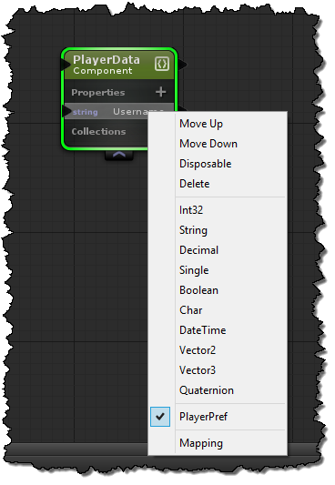

# Descriptors
Descriptors allow you to tag specific properties on components that define additional information about it.  This often results in an attribute attached to the property so that it can easily be queried.  Here are a few examples of descriptors to that may give you a better idea, NetworkSync, SaveForReplay, SerializeToCloud, SerializeToPrefs...etc There are so many different ways you can work with this information, we wanted to build direct support for creating your own.

To activate a descriptor on a property just right-click it and select the descriptor.


Now when the component is generated it will generate the following code.
```cs
[PlayerPrefAttribute()]
public String Username {
    get {
        return _Username;
    }
    set {
        SetUsername(value);
    }
}
```

When you add a descriptor to a property, uFrame will also categorize the component by adding a interface to it.  This makes it easier to filter down to all of the components that actually have properties with these attribute attached to them.  This also makes these components a part of their own group, they can be used on handlers just like components and groups.

Here is the interface for the PlayerPref Descriptor:
```cs
public partial interface IPlayerPref : uFrame.ECS.IEcsComponent {

    System.Reflection.PropertyInfo[] PlayerPrefMembers {
        get;
    }
}
```
And here is what uFrame will do to any component that has a property with the PlayerPref attribute. Notice it implements IPlayerPref and its required PlayerPrefMembers.  Also notice that the field it generates is static, this way we only need to cache it once.
```cs
   public partial class PlayerData : uFrame.ECS.EcsComponent, IPlayerPref {

       // --- Removed for clarity
      private static System.Reflection.PropertyInfo[] _PlayerPrefMembers;

       public System.Reflection.PropertyInfo[] PlayerPrefMembers {
           get {
               if (_PlayerPrefMembers == null) {
                   _PlayerPrefMembers = this.GetDescriptorProperties<PlayerPrefAttribute>().ToArray();
               }
               return _PlayerPrefMembers;
           }
       }
      // --- Removed for clarity
   }
```
## Serializing Components With Descriptors
By default uFrame ECS has its own extension methods to serialize all tse properties with a specific attribute to json.  This comes in handy with descriptors as again, they generate attributes on properties and collections.

Here is an example of deserializing a component based on the player prefs descriptor.
```cs
protected override void LoadAllPlayerPrefsHandler(GameReadyEvent data, IPlayerPref @group)
{
    base.LoadAllPlayerPrefsHandler(data, @group);
    var key = @group.EntityId + "_" + @group.ComponentId;
    group.DeserializeComponent<PlayerPrefAttribute>(JSON.Parse(PlayerPrefs.GetString(key)));
}
```
