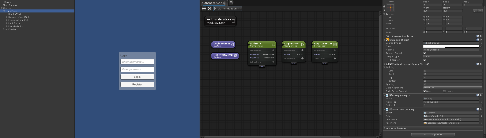
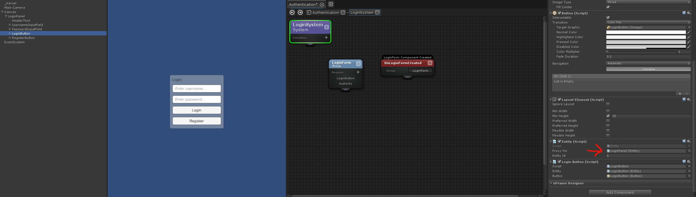

# Entity Proxies - Creating Composite Entities

Let's say you have a set of components that all need to work together, or a composite entity.
For example, a menu screen made up of the following:

- UsernameInput
- PasswordInput
- LoginButton

We'll need to create a component for the LoginButton, and add an OnPointerClickDispatcher to it.
However, we'll need to retrieve the Username and Password values in our LoginSystem. They'll need to belong to the same entity.

We could create a single LoginComponent with UsernameInput, PasswordInput, and LoginButton properties.
Or we could keep things really modular and instead use 3 separate components tied together with Entity Proxies.
Here's our main layout:


This is how the Login button is setup:


Notice that the Entity for the LoginButton is just a proxy for the LoginPanel entity.
This makes the LoginButton part of the same entity as the LoginPanel (which contains the AuthInfo).
Then you can do some pretty cool code with validation to enable/disable the Login button:

```cs
namespace Example {
    using UniRx;
    using UnityEngine;
    
    public partial class LoginSystem {
​
        protected override void OnLoginFormCreated( LoginForm data, LoginForm group ) {
​
            group.LoginButton.Button.onClick.AddListener(() => OnClickLogin(group));
​
​
            var usernameChangesStream = group.AuthInfo.Username.OnValueChangeAsObservable();
            var passwordChangesStream = group.AuthInfo.Password.OnValueChangeAsObservable();
            usernameChangesStream.Merge( passwordChangesStream )
                .Subscribe(_ => ValidateForm(group) );
        }
​
        void ValidateForm( LoginForm group ) {
            bool hasUsername = group.AuthInfo.Username.text.Trim().Length > 0;
            bool hasPassword = group.AuthInfo.Password.text.Trim().Length > 0;
            group.LoginButton.Button.interactable = hasUsername && hasPassword;
        }
​
        void OnClickLogin( LoginForm group ) {
            Debug.Log(string.Format("Login with Username: {0}", group.AuthInfo.Username.text));
        }
​
    }
}
```
