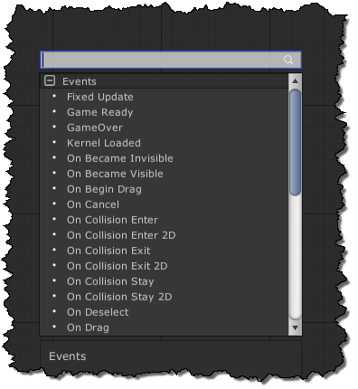
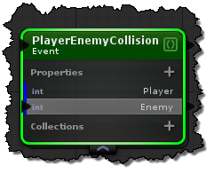
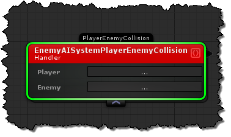

# Events


## Creating Custom Events In the designer
To create a custom event in the designer right-click in an empty space in a module or library graph and select "Create Event".



### Mappable Id's
To create mappable id's for handler nodes. Make sure you select a property in the event node, then in the inspector check the "Mapping" checkbox.  This will result in the following event handler:



## Publishing Events


## Create Scripting Compatible Events In Code
```cs
using uFrame.Attributes;

// All you need is this attribute for it to display in the uFrame events list
[uFrameEvent("My Custom Event")]
public class PlayerEnemyCollision {

    [uFrameEventMapping("Player")]
    public int PlayerId {get;set;}

    [uFrameEventMapping("Enemy")]
    public int EnemyId { get; set; }
}
```
### Creating Custom Dispatchers

```cs
using uFrame.Attributes;
// Make sure you use UFrameEventDispatcher instead of uFrameEvent
[UFrameEventDispatcher("On Mouse Down")]
public class MouseDownDispatcher : EcsDispatcher
{
    public void OnMouseDown()
    {
        Publish(this);
    }
}
```
