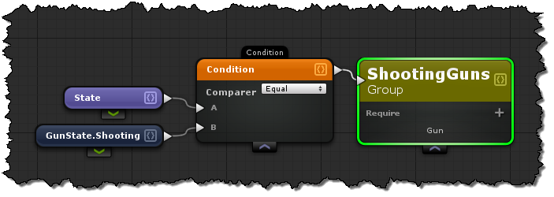

# Group Nodes

## "Require" Items
Require allows you to select specific components or other groups that an Entity must have in order for it to belong to the group.  

For example, If we have an entity with a health component, and a damagable component.  We might create a "Destructible" group for all the entities that have both of these components.  This creates context that handlers can use to work with only a specific set of entities in a very effecient manner.

## Expression Matching
Expression matching allows you to further filter the groups entities based on its data.

For example, if we have a "HealthComponent", we may want to have a group of entities that could be considered "Healthy".  We would then create an expression that makes sure the health value is above a certain threshold.

## Scripting
#### Related Actions
- [Get Component]()
- [Loop Components]()

#### Related Events
- [On Component Created]()
- [On Component Destroyed]()
- [On Property Changed]()

## Creating Groups in code
```cs
public partial class ShootingGunsGroup : ReactiveGroup<ShootingGuns> {
    // Used in the Match method for querying if a component exists.
    public IEcsComponentManagerOf<Gun> GunManager { get; set;}

    // When to evaluate when an item still belongs to a group.
    // This method is invoked by the component system during initialization.
    public override IEnumerable<IObservable<int>> Install(IComponentSystem componentSystem) {
        componentSystem.PropertyChanged<Gun, GunState>
          (_ => _.StateObservable, (c, v) => { UpdateItem(c.EntityId); });
        GunManager = componentSystem.RegisterComponent<Gun>();
        yield return GunManager.CreatedObservable.Select(_=>_.EntityId);
        yield return GunManager.RemovedObservable.Select(_=>_.EntityId);
    }

    private int lastEntityId;
    private Gun Gun;
    // Does the entity match the group
    public override bool Match(int entityId) {
        lastEntityId = entityId;
        if ((Gun = GunManager[entityId]) == null) {
            return false;
        }
        if (Gun.State==GunState.Shooting) {
            return true;
        }
        else {
            return false;
        }
        return true;
    }
    // The Select method will acquire the last matched group component
    public override ShootingGuns Select() {
        var item = new ShootingGuns();
        item.EntityId = lastEntityId;
        item.Gun = Gun;
        return item;
    }
}

```

## F.A.Q
**Why are there a limited amount of actions on group expressions?**

Groups are meant to be re-active, so that when a component is added, removed, or one of its property changes, it will re-evaluate if it still belongs to the group.  If there were more options it would be impossible to keep the validity of the group in a re-active manner.
