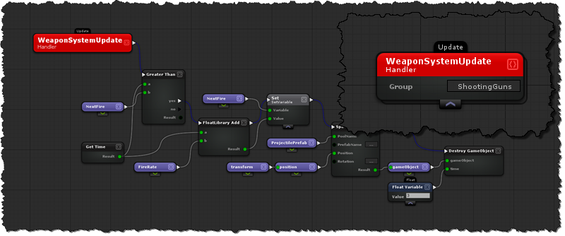
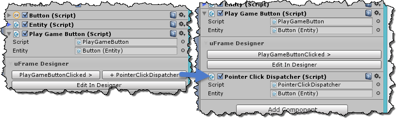

# Event Handler Nodes
Event handlers allow you to listen to a specific event and execute a sequence of actions (Visual Scripting) whenever an event occurs.

In uFrame you can listen to custom events defined in a library, all the standard unity messages, events defined in code tagged with the [uFrameEvent] attribute, or some other useful built-in events such as property-changes, and component/group created or removed events.

## Scripting
- [Component Created](../Handlers/ComponentCreated.md)
- [Component Created](../Handlers/Destroyed.md)
- [Property Changes](../Handlers/PropertyChanged.md)

# Entity Group Mappings
Entities are identifiable by a number, it is often the case where you want to signal an event for an entity and allow the handler to determine what group it should process the event with.  For this reasons, any integer property defined on an event will be available for mapping a group or component to it on the handler.

A good example of this is OnCollisionEnter, any component could process this type of event, but it must belong to an entity.  So therefore it has two properties:
- EntityId - The Source Id
  > By default "EntityId" appears as group on handler nodes
- ColliderId -The id of the entity that collided with

# Important! Event Dispatchers
Because components that belong to an entity can live on different game-objects, uFrame doesn't have a way to determine where the event should be dispatched from.  These types of events are a subset (Unity Messages).  In this case, uFrame will display a button on the component to ensure that you've added the dispatcher to the game-object.

Also See:
  - [Events](../Handlers/Events.md)
  - [Entities](EntityComponent.md)
