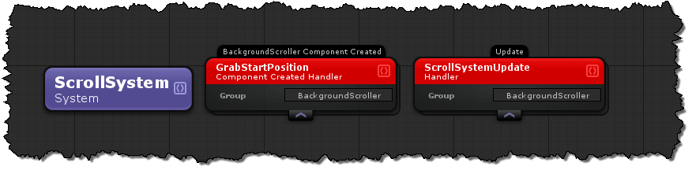

# Systems (The "S" in ECS)
Systems are the bridge between groups/components, events and handlers to life.  With a system group multiple event handlers can be comprised into a logical group.


## Also See
- [Event Handlers](../API/Handlers.md)
- [Groups](../API/Groups.md)
- [Components](../API/Components.md)

# API Documentation
Systems in code derive from EcsSystem, EcsSystem derives from the uFrame Kernel's SystemServiceMonoBehaviour.

## Creating a system in code
To create systems in code there are a few notable methods to take note of and understand their responsibilities.

### public virtual void EcsSystem.Setup()
```cs
public override void Setup() {
    base.Setup();
}
```
This method is soley responsible registering access to groups, components, listening for events, and publishing events.  Here are some examples of doing that.
##### Registering Groups
```cs
// Store the manager in a property so that it can be accessed later.
/* IECSComponentManagerOf<ShootingGuns> */
ShootingGunsManager = ComponentSystem.RegisterGroup<ShootingGunsGroup,ShootingGunsComponent>();
```
##### Registering Components
```cs
// Store the manager in a property so that it can be accessed later.
/* IECSComponentManagerOf<HealthComponent> */
HealthComponentManager = ComponentSystem.RegisterComponent<HealthComponent>();
```

##### Subscribing to Events
```cs
this.OnEvent<PlayGame>()
  .Subscribe(playGame=>Debug.Log("The Game Has Started!"))
  .DisposeWith(this); // Always dispose the event with the system
```

##### Subscribing to component creation/removal
```cs
// Register the manager first, this work for both components and groups
ShootingGunsManager = ComponentSystem.RegisterGroup<ShootingGunsGroup,ShootingGuns>();
// Listen for group/component created
ShootingGunsManager.CreatedObservable
  .Subscribe(component=>Debug.Log("A gun is now shooting."))
  .DisposeWith(this);
// Listen for group/component removal
ShootingGunsManager.RemovedObservable
  .Subscribe(component=>Debug.Log("A gun has stopped shooting"))
  .DisposeWith(this);
```

##### Subscribing To Property Changes
```cs
this.PropertyChanged<Health,int>(
    _=>_.ValueObservable, // The Property to listen for
    (component, value) =>
    {
        Debug.Log("Health was changed to " + value);
    }); // No need for disposal its already taken care of for you
```
