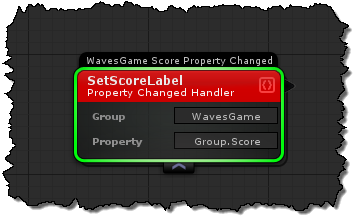
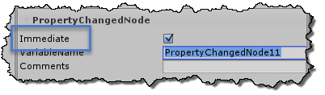

# Property Changed Handlers

### Group
The group you want to assign this property change handler to.  Property changes can be applied to both components, and groups.

### Property
The property that you will listen for changes on.

## Inspector options
### Immediate
When selecting immediate in the inspector, it will ensure that the handler is invoked when it is first initialized.  This usually happens when a component has an initial value set in the inspector, and the property changed handler not being initialized till after the value is already set.

