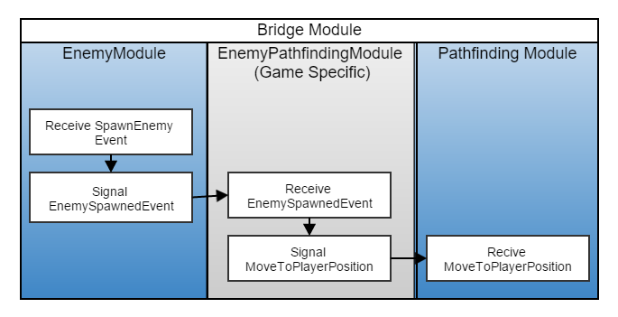

# uFrame ECS Game Development

## Step 1 - High Level Module Definition
Normally when developing a game we define some high level features that together comprise as the game your developing.  This is exactly what you'll do in uFrame we'll demonstrate by example, but we should define what a module consists of first. Modules define multiple things in uFrame, but the absolute must know are:

- Components - The data structures. Things like Damageable, Targetable, and their properties, health, maxtargets... etc
- Events - These define the information that can be used when communicating between systems.  You could define an event and listen to it all in one module.  Or you can define an event that you publish and other systems can listen for it.
- Systems - These are the behaviours that tie Events and components together, actually performing some kind of rule or logic based on the event that has occurred, and the data that currently resides on our components. After completing specific functionality systems can publish new events to the universe so that any other system that cares about it can handle appropriately.

Ok now lets get back to the example of what this might look like from the view of the game in its entirety.

- SoundFXModule - Listens to all the events where sounds should play and does nothing more than play them.
- VisualFXModule - Listens to all the events where sounds should play and does nothing more than play them.
- CombatModule - Listens for input from the user, signals any kind of AI system, or signals custom events so other modules/systems can do their own things (e.g. GunFired, SwordSlashed)
- EnemiesModule - Handles spawning enemies by category, race, difficulty etc, then publishes events after performing any of those.
- HUDModule - Handles updating the UI based on the current game state. PropertyChanges, collection changes, special events. etc.
- NotificationModule - Similar to HudModule but can be re-used without any coupling to any objects.
- AchievementsModule - A general module for handling and displaying achievements, synchronization to the server, etc..
- MenuModule - Handles the main menu scene, dialogs, menus, buttons, etc
- GameModule - Orchestrates moving too and from game modes, main menus, handles loading multiple scenes together etc.
- PathfindingModule - Listens for events like "NavigateToEnemy", "Stop".. etc
- WavesModule - Basically just a special timer that works randomly base on incrememnts, and providing random race/difficulty levels
- TargetingModule - Handles applying targets, most likely could be as simple as a TargetableComponent, with a Targets collection on it.
- SpellCastingModule - Handles spell casting from a high level, has components specific to spells and their properties.
- UserModule - Handles login/logout.  Publishing user information once a user has logged in.  etc
- ...etc

This list could grow to be fairly large depending on the complexity of the game you're building.  If you get stuck on this part, don't feel like your doing it wrong, clearly defining/naming these guys is arguably one of the most complicated steps.  But remember, it will get your brain ticking, this is a good thing, you want to think first implement second (Ok they both require thinking, but having these clearly defined up front will save you TONS of time and effort moving forward).  
> Note: Even if you have to write it down when pen or paper, always do this step, when writing this I actually figured out more modules that would make sense, and its nothing more than an example.

## The Bridge Module - Keeping things re-usable
> So before explaining this, it is important to note, this is entirely optional.  It will keep your modules very separated and reusable, but does require some extra work up-front.  With that said lets jump into it.

So lets take two modules "EnemiesModule" and "CombatModule" for our explanation and example.  Either one of them could easily be reused in another game, but in your current game when a enemy is spawned it must begin navigating to the player.  This would mean that the EnemyModule must know about the pathfinding system or vice-versa.

 To keep this from happening we can create bridge modules.  Put simply it works like this:
- Modules: The completely seperate pieces of a game.
- Bridge Modules: Modules that are very game specific and connect two or more modules together by listening for one event, processing (if needed) and publishing another event.

Ok, now that you know the idea behind it, here is a step by step example of how this works.

> Note: Every event regardless of the module can be received or published from any module.

The key thing to note here is the now that we have bridge module, neither the enemy module, nor the pathfinding module know about each other, making them much more re-usable than before.

## Chapter 2 - Component Definition
Components make up the state of an entity. They are comprised of nothing more than properties and collections. Properties are the variables used by system handlers to keep up with the state of a behvaiour.  Keeping these small and specific to a single role can play large role in the re-usability of your components.  

Ok, so lets look at an example of a bad component design, and re-create it with a better and more flexible design.

##### Bad
Player {
   Health;
   Mana;
   CurrentTarget;
   TargetableTypes;
   DeathEffect;
   DeathSound;
   LoginName;
}

##### Good
HealthComponent { Health }

ManaComponent { Mana }

TargetableComponent { CurrentTarget, TargetableTypes }

Player { } // Nothing just an attribute component

Notice that in this approach we are clearly defining components as very separate pieces of information. This gives a designer the ability to compose entities as they see fit, and gives a lot of play room to compose some very unique entities.

### Attribute Components
A key concept in component design is that they can be used for more than one purpose. They can also be used as attributes to facilitate grouping.  While every component is a group in and of itself, they could all be considered attributes.  But for the sake of clarity, attribute components consist of zero properties.  

## Chapter 3 - Groups - Creating Context
Groups allow behaviours to work within a specific context.  For instance: Imagine you're at a new job and your first task it to hire some new people.  If your boss walks up to you and says "Hire everyone with an IQ that is greater than 120" he's giving you both the behavior ( to "Hire" ) and the context ( "everyone with an IQ that is greater than 120").  He could also say, "hire people" and that be exactly what is desired (it might be ineffective in this case, but irrelevant to the point). This is exactly how grouping works filtering all entities into a smaller subset of entities that match a certain criteria.

### Faster Iteration
Since groups are essentially a list this is maintained internally (only when relevant data changes), during performance critical situations, there isn't a need to "look-up" or query for this information.  This can have a major performance increase, especially inside of an update loop.

### Notifications
In uFrame ECS notifications of when an entity newly matches within a group or no longer matches can be used for a lot of different situations.

Imagine we have a health component that has a single numeric value, and we have a group called

## Chapter 4 - Handlers - The Behavior for the context
